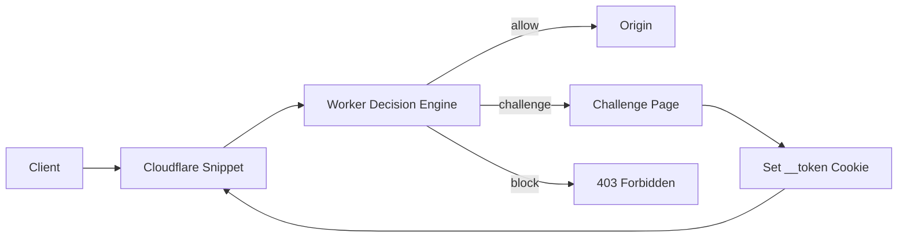

<h1 align="center">EdgeShield</h1>

<p align="center">
  基于 Cloudflare Snippets + Workers 的轻量边缘 WAF
</p>

<p align="center">
  <a href="https://workers.cloudflare.com/"></a>
  
  
</p>

EdgeShield 在 Cloudflare 边缘拦截请求：Snippet 负责入口转发，Worker 负责评分决策，KV 保存最小 IP 黑名单。当前支持 `allow`、`challenge`、`block` 三种动作。

> 当前版本是 MVP。挑战 token 仍是演示级实现，适合验证链路和小范围试点，不建议直接作为高强度反机器人方案。

## 快速开始

最省事的方式是让 Cloudflare 从 GitHub 拉取仓库并执行部署命令。

### Cloudflare 控制台部署

1. 打开 [Cloudflare Workers & Pages](https://dash.cloudflare.com/?to=/:account/workers-and-pages/create)。
2. 选择 `Continue with GitHub`，授权并选择 `EdgeShield` 仓库。
3. 填写命令：

| 项目 | 填写内容 |
| --- | --- |
| Build command | `npm run check` |
| Deploy command | `npm run deploy:all` |

4. 添加下面的必要变量。
5. 保存并部署。

## 必填配置

部署需要同时操作 Worker、KV、Snippet 和 Zone 规则。为了减少手工复制，脚本会尽量自动解析 Account 和 Zone：

- `CLOUDFLARE_ACCOUNT_ID` 可以不填；如果 token 只关联一个账号，脚本会自动识别。
- `CLOUDFLARE_ZONE_ID` 可以不填；推荐填更直观的 `PROTECTED_HOSTNAME=www.example.com`，脚本会从 Cloudflare Zone 列表自动匹配。
- `CLOUDFLARE_API_TOKEN` 不能自动生成，必须在 Cloudflare 页面创建。

### 最小变量

推荐只填 token 和要保护的域名：

```text
CLOUDFLARE_API_TOKEN=你的 Cloudflare API Token
PROTECTED_HOSTNAME=www.example.com
```

脚本会自动生成：

```text
SNIPPET_EXPRESSION=(http.host eq "www.example.com")
```

如果你的 token 能访问多个 Cloudflare 账号，再补一个账号字段：

```text
CLOUDFLARE_ACCOUNT_ID=你的 Account ID
```

也可以用账号名：

```text
CLOUDFLARE_ACCOUNT_NAME=你的 Cloudflare 账号名称
```

### 可视化获取清单

| 要填什么 | 推荐变量 | 是否必须 | 页面位置 | 备注 |
| --- | --- | --- | --- | --- |
| API Token | `CLOUDFLARE_API_TOKEN` | 是 | Cloudflare 右上角头像 -> `My Profile` -> `API Tokens` -> `Create Token` | 创建后只显示一次，立即复制保存 |
| 要保护的域名 | `PROTECTED_HOSTNAME` | 是 | 浏览器地址栏或 Cloudflare 站点域名，例如 `www.example.com` | 脚本会自动匹配所属 Zone，并生成 Snippet 表达式 |
| 保护路径 | `PROTECTED_PATH_PREFIX` | 否 | 自行填写，例如 `/login` | 只保护某个路径前缀 |
| 自定义保护范围 | `SNIPPET_EXPRESSION` | 否 | 自行填写 Cloudflare Rules 表达式 | 设置后会覆盖 `PROTECTED_HOSTNAME` 自动表达式 |
| Account ID | `CLOUDFLARE_ACCOUNT_ID` | 多账号时需要 | Cloudflare Account 首页右侧栏 | 单账号 token 可自动识别 |
| Zone ID | `CLOUDFLARE_ZONE_ID` | 可替代域名 | 进入目标站点后右侧栏 `Zone ID` | 不想给 `Zone:Read` 时可直接填 Zone ID |

### 完整变量说明

| 变量 | 必填 | 示例 | 用途 | 获取位置 |
| --- | --- | --- | --- | --- |
| `CLOUDFLARE_API_TOKEN` | 是 | `***` | 调用 Cloudflare API 完成部署 | Dashboard -> My Profile -> API Tokens |
| `PROTECTED_HOSTNAME` | 推荐 | `www.example.com` | 自动生成保护表达式并匹配 Zone | 浏览器地址栏或 Cloudflare 站点域名 |
| `PROTECTED_PATH_PREFIX` | 否 | `/login` | 限定保护路径前缀 | 自行填写 |
| `CLOUDFLARE_ZONE_NAME` | 推荐 | `example.com` | 自动解析 Zone ID | Cloudflare 站点列表 |
| `CLOUDFLARE_ZONE_ID` | 二选一 | `abcdef0123456789abcdef0123456789` | 指定 Snippet Rule 挂载的站点 | 进入目标站点后右侧栏 `Zone ID` |
| `CLOUDFLARE_ACCOUNT_ID` | 多账号时需要 | `0123456789abcdef0123456789abcdef` | 指定部署账号 | Cloudflare 账号首页右侧栏 |
| `CLOUDFLARE_ACCOUNT_NAME` | 可替代 Account ID | `My Account` | 自动解析 Account ID | Cloudflare Account 名称 |
| `SNIPPET_EXPRESSION` | 建议填写 | `(http.host eq "www.example.com")` | 限定哪些请求进入 WAF | 按需要填写 Cloudflare Rules 表达式 |

### API Token 权限

| 范围 | 权限 | 用途 |
| --- | --- | --- |
| Account | `Workers Scripts:Edit` | 发布 Worker |
| Account | `Workers KV Storage:Edit` | 创建或复用 KV namespace |
| Account | `Account Settings:Read` | Wrangler 读取账号信息 |
| Zone | `Snippets:Edit` | 创建 Snippet 和 Snippet Rule |
| Zone | `Zone:Read` | 用域名自动解析 Zone ID，或用脚本自动识别 Zone |

建议把 Token 的资源范围限制到当前 Account 和目标 Zone。

## 保护范围

`PROTECTED_HOSTNAME` 会自动生成最常用的保护表达式。如果你需要更细的范围，再直接设置 `SNIPPET_EXPRESSION`。

常用表达式：

```text
# 只保护一个域名
(http.host eq "www.example.com")

# 只保护登录路径
(http.host eq "www.example.com" and starts_with(http.request.uri.path, "/login"))

# 保护整站，但排除静态资源目录
(http.host eq "www.example.com" and not starts_with(http.request.uri.path, "/assets/"))
```

## 可选配置

| 变量 | 默认值 | 说明 |
| --- | --- | --- |
| `WORKER_NAME` | `edge-waf-v0-1` | Cloudflare Worker 名称 |
| `KV_NAMESPACE` | `edge-waf-v0-kv` | KV namespace 名称，不存在时自动创建 |
| `SNIPPET_NAME` | `edge_waf_gate` | Cloudflare Snippet 名称，只能使用小写字母、数字和下划线 |

## 部署命令做了什么

`npm run deploy:all` 会按顺序完成：

1. 校验必要环境变量。
2. 创建或复用 KV namespace。
3. 生成 `wrangler.generated.toml`，写入真实 KV id。
4. 部署 Worker。
5. 把真实 Worker decision URL 写入 Snippet。
6. 创建或更新 Cloudflare Snippet。
7. 创建或更新 Snippet Rule。

部署完成后，Cloudflare 请求链路如下：



## 本地 CLI 部署

```bash
git clone https://github.com/liut-coder/EdgeShield.git
cd EdgeShield
npm install
npm run deploy:all
```

本地执行前需要先设置必填环境变量。Windows PowerShell 示例：

```powershell
$env:CLOUDFLARE_API_TOKEN="你的 token"
$env:PROTECTED_HOSTNAME="www.example.com"
npm run deploy:all
```

如果 token 能访问多个 Cloudflare 账号，再补充：

```powershell
$env:CLOUDFLARE_ACCOUNT_ID="你的 account id"
```

## GitHub Actions 部署

仓库内置手动触发的 workflow：

```text
.github/workflows/deploy-cloudflare.yml
```

使用步骤：

1. 进入 GitHub 仓库 `Settings -> Secrets and variables -> Actions`。
2. 添加 `CLOUDFLARE_API_TOKEN`。
3. 添加 `PROTECTED_HOSTNAME`，例如 `www.example.com`；也可以改填 `CLOUDFLARE_ZONE_NAME` 或 `CLOUDFLARE_ZONE_ID`。
4. 如果 token 能访问多个 Cloudflare 账号，添加 `CLOUDFLARE_ACCOUNT_ID` 或 `CLOUDFLARE_ACCOUNT_NAME`。
5. 进入 `Actions -> Deploy to Cloudflare -> Run workflow`。
6. 按需覆盖 `worker_name`、`kv_namespace`、`snippet_name`、`snippet_expression`。

## 常见问题

### 缺少 Zone ID

报错示例：

```text
Error: A Cloudflare zone is required for Snippet deployment.
```

处理方式：

1. 在 Cloudflare Workers & Pages 项目的变量或 Secret 中添加 `PROTECTED_HOSTNAME`，例如 `www.example.com`。
2. 确认 API Token 有 `Zone:Read` 权限。
3. 重新部署。

也可以直接设置 `CLOUDFLARE_ZONE_ID`，这样不需要脚本自动匹配 Zone。

### Snippet 影响范围过大

检查 `SNIPPET_EXPRESSION`。如果它是 `true`，Snippet 会在整个 Zone 生效。建议先改成单域名表达式：

```text
(http.host eq "www.example.com")
```

### GitHub 拒绝推送 workflow 文件

如果 GitHub 拒绝 push `.github/workflows/deploy-cloudflare.yml`，说明当前 GitHub PAT 缺少 `workflow` scope。给 PAT 增加 `workflow` 权限后重试。

## 项目结构

| 路径 | 作用 |
| --- | --- |
| `snippets/edge-gate.js` | Snippet 入口网关，旁路静态资源并请求 Worker 决策 |
| `worker/index.js` | Worker 决策入口，返回 `allow`、`challenge` 或 `block` |
| `worker/scoring.js` | MVP 规则打分 |
| `worker/challenge.js` | 生成挑战页和内联检查脚本 |
| `worker/utils.js` | 输入解析、JSON 响应、Cookie 和 token 工具 |
| `scripts/deploy-cloudflare.mjs` | 完整部署编排 |
| `scripts/deploy-snippet.mjs` | Snippet API 上传和 Snippet Rule 更新 |
| `kv/schema.md` | KV key 约定 |

## 决策规则

```text
score = 0
if ua missing or too short  +40
if path contains /login     +10
if KV bad:<ip> exists       +60
```

| 分数 | 动作 |
| --- | --- |
| `0-39` | `allow` |
| `40-79` | `challenge` |
| `80+` | `block` |

KV 黑名单格式：

```text
bad:<ip> = 1
```

## 当前状态

已实现：

- Cloudflare Snippet 请求入口过滤
- Worker 决策核心
- IP / UA / path 规则打分
- JS challenge 和 MVP cookie token
- KV bad IP 查询
- Cloudflare 控制台、CLI、GitHub Actions 三种部署入口

后续预留：

- rate limiting
- 服务端签名 trust token
- bot scoring API
- 更完整的测试覆盖
